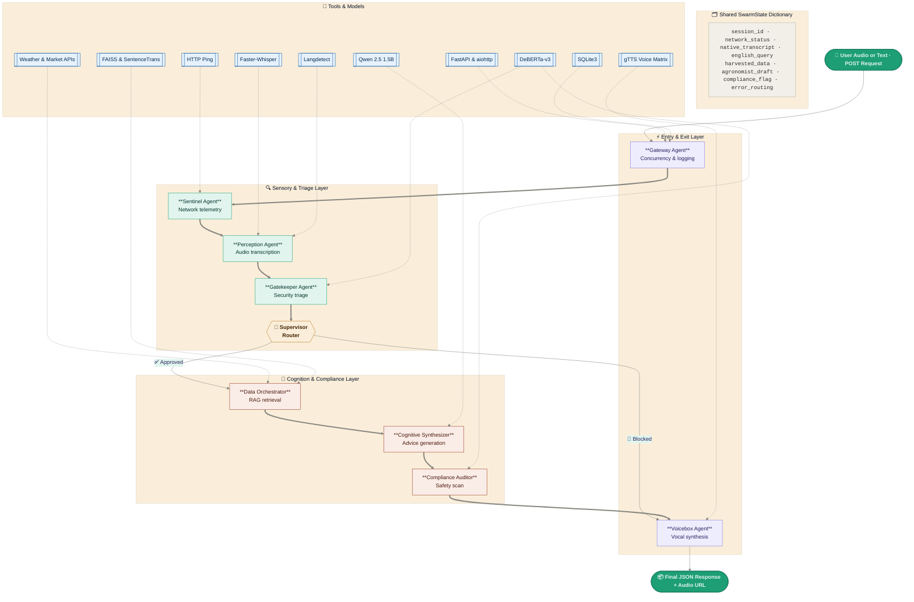

# 🌾 AgriTech AI Swarm: Microservices Architecture


A production-grade, multi-agent artificial intelligence backend designed to provide localized, RAG-augmented agricultural heuristics to farmers.

This repository utilizes a **Microservices Architecture**. It separates standard business logic (validation, rate-limiting, and security) from heavy AI inference (transcription, LangGraph state-routing, and LLM synthesis) to ensure high availability, statelessness, and secure frontend integration.

---

## 🏗️ System Architecture & Request Lifecycle

The system is divided into two distinct services communicating internally:

1. **Primary API Gateway (Node.js/TypeScript):**
   - **Role:** The frontend-facing server (Port 3000).
   - **Responsibilities:** Request validation (Zod), payload sanitization, security (Helmet/CORS), rate limiting, enterprise logging (Winston/Pino), and standardized JSON response enveloping.

2. **AI Inference Engine (Python/FastAPI):**
   - **Role:** The internal, private AI worker (Port 8000).
   - **Responsibilities:** Faster-Whisper transcription, DeBERTa zero-shot guardrails, FAISS offline RAG retrieval, Qwen 2.5 LLM synthesis, and gTTS audio generation. It operates completely **statelessly**, converting audio payloads to Base64/Buffers and cleaning up its local disk immediately after processing.

**Request Flow:**
```
Frontend Request ➡️ Node.js Gateway (Validation) ➡️ Python FastAPI (LangGraph Swarm) ➡️ Node.js Gateway (Formatting) ➡️ Frontend Response
```

### 🧠 AI Swarm Agent Graph



---

## 📁 Repository Structure

```text
agritech-microservices/
├── api_gateway/                # Primary Node.js/TypeScript Backend
│   ├── src/
│   │   ├── controllers/
│   │   ├── middlewares/        # Rate limiting, Zod validation, Error handlers
│   │   ├── services/           # Axios handlers to communicate with Python AI
│   │   └── index.ts            # Express/NestJS entry point
│   ├── package.json
│   └── tsconfig.json
│
├── ai_pipeline/                # Internal Python AI Inference Engine
│   ├── src/
│   │   ├── server.py           # FastAPI Master Swarm Architecture
│   │   ├── agents/             # LangGraph nodes (Perception, Agronomist, etc.)
│   │   └── utils/              # Base64 encoding and background cleanup tasks
│   ├── swarm_env/              # Isolated Python virtual environment
│   └── requirements.txt
│
└── README.md                   # Master documentation
```

---

## ⚙️ Local Setup Guide (WSL / Ubuntu)

### Prerequisites

- **OS:** Windows Subsystem for Linux (WSL 2) running Ubuntu.
- **Node.js:** v18.x or higher.
- **Python:** v3.10 or higher.

---

### Step 1: System-Level Dependencies

The AI engine requires OS-level C-libraries to decode audio binaries and manage the internal R&D audit database.

```bash
sudo apt update
sudo apt install ffmpeg sqlite3
```

---

### Step 2: Setup the Python AI Engine (`ai_pipeline`)

Navigate to the AI directory, create a strict sandbox, and install the CPU-forced ML libraries.

```bash
cd ai_pipeline

# 1. Forge and activate the sandbox
python3 -m venv swarm_env
source swarm_env/bin/activate

# 2. Install PyTorch (CPU-Only Bridge)
pip install torch torchvision torchaudio --index-url https://download.pytorch.org/whl/cpu

# 3. Install the Swarm Framework
pip install fastapi uvicorn pydantic langgraph transformers==4.46.1 accelerate faster-whisper gtts deep-translator aiohttp sentence-transformers faiss-cpu langdetect
```

---

### Step 3: Setup the Node.js API Gateway (`api_gateway`)

Open a new terminal window (leave the Python terminal for later) and navigate to the gateway directory.

```bash
cd api_gateway

# Install standard dependencies (Express, Zod, Axios, etc.)
npm install

# (Optional) If using TypeScript, ensure types are installed
npm install -D typescript @types/node @types/express ts-node
```

---

## 🚀 Running the Full Stack Locally

To run the complete microservices architecture, you must boot both servers simultaneously in two separate terminal windows.

### Terminal 1: Boot the Internal AI Engine

```bash
cd ai_pipeline
source swarm_env/bin/activate
python3 src/server.py
```

> Runs on `http://127.0.0.1:8000`. Note: Initial boot downloads ~3GB of neural weights. Wait for `Application startup complete.`

### Terminal 2: Boot the Primary API Gateway

```bash
cd api_gateway
npm run dev
```

> Runs on `http://127.0.0.1:3000`. This is the server your frontend will talk to.

---

## 📡 API Reference (Frontend Integration)

Your frontend application (React/Next.js) will only ever communicate with the Node.js Gateway.

- **Endpoint:** `POST http://127.0.0.1:3000/api/v1/consultation`
- **Headers:** `Content-Type: application/json`

### Payload Example (Text)

```json
{
    "inputType": "text",
    "query": "My cotton leaves are turning yellow and curling downwards. What should I do?"
}
```

### Expected Success Response

The Node.js gateway standardizes all responses into a predictable envelope for easy frontend parsing.

```json
{
    "success": true,
    "data": {
        "detectedLanguage": "en",
        "originalTranscript": "My cotton leaves are turning yellow...",
        "translatedAdvice": "Based on local KVK guidelines, this indicates...",
        "audioResponseBase64": "UklGRiQAAABXQVZFZm10IBAAAAABAAEARKwAAIhYAQACABAAZGF0YQAAAAA..."
    },
    "error": null
}
```

### Expected Error Response

If Zod validation fails, or if the Python server rejects the request (e.g., profanity detected), the Node gateway returns a clean error envelope.

```json
{
    "success": false,
    "data": null,
    "error": {
        "code": 400,
        "message": "Validation Error: Unsupported audio format or payload exceeds 5MB limit."
    }
}
```

---

## 🛡️ Production & Security Standards

- **Statelessness:** The Python server utilizes `BackgroundTasks` to explicitly delete temporary `.mp3` files off the hard drive the millisecond the response is fired back to the Node.js server.
- **Network Isolation:** In a production environment (like AWS or Docker), the `ai_pipeline` port (`8000`) should be blocked from the public internet entirely, accepting traffic only from the internal `api_gateway`.
